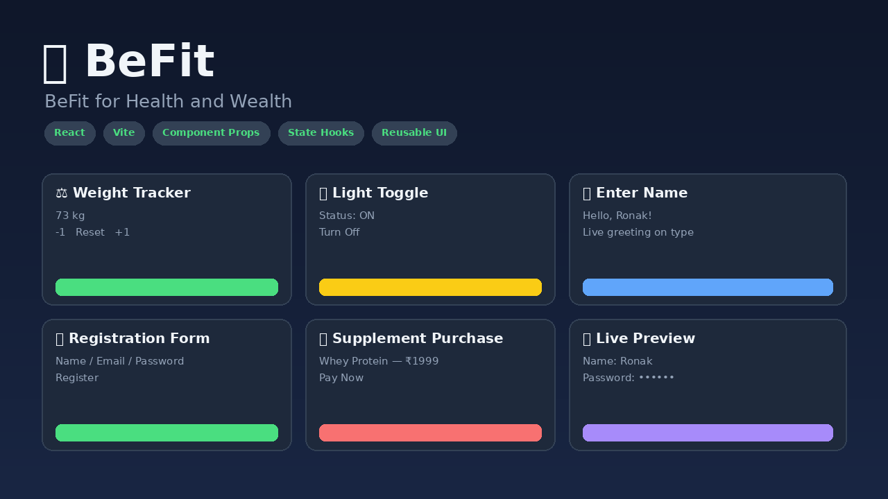

# 🏋️ BeFit — BeFit for Health and Wealth

A responsive React (Vite) fitness mini-app built as part of a Full Stack Developer bootcamp assignment on **React Component Rendering** — covering component creation, props, reusable UI, and state management with `useState`.

🔗 **Live Demo (GitHub Pages):** https://ronak861.github.io/BeFit-ReactNative/
🔗 **Live Demo (Netlify):** https://befit-reactnativ.netlify.app/



## ✨ Features

- **⚖️ Weight Tracker** — increment / decrement / reset counter
- **💡 Light Toggle** — on/off switch that also drives the app's theme
- **👋 Enter Name** — live greeting as you type
- **📝 Registration Form** — name, email, password with live preview
- **💳 Supplement Purchase** — card details + transaction password (show/hide)
- **👁️ Live Preview** — real-time reflection of form input via props

## 🛠️ Tech Stack

- React 18 (Vite)
- Component-based architecture — 6 reusable components rendered in `App.jsx`
- State management with `useState`
- Custom CSS (glassmorphism-inspired dark theme)

## 📂 Project Structure

src/
components/
Header.jsx
WeightCounter.jsx
LightToggle.jsx
NameGreeter.jsx
RegistrationForm.jsx
CardTransaction.jsx
App.jsx
App.css
main.jsx


## 📦 Build & Deploy

```bash
npm run build
npm run deploy
```

---
Built with 💪 by [Ronak](https://github.com/Ronak861)
BeFit — BeFit for Health and Wealth

A responsive, fully interactive React (Vite) fitness dashboard built as part of a Full Stack Developer bootcamp assignment on **React Component Rendering**. Demonstrates component creation, props-based data flow, reusable UI patterns, and multi-component state management with `useState`.

🔗 **Live Demo (GitHub Pages):** https://ronak861.github.io/BeFit-ReactNative/
🔗 **Live Demo (Netlify):** https://befit-reactnativ.netlify.app/
📦 **Repository:** https://github.com/Ronak861/BeFit-ReactNative


---

## 📖 About

**BeFit** is a mini fitness & wellness dashboard that combines everyday health tracking (weight, ambience, personalized greetings) with a mock e-commerce flow (supplement purchase with card + password) and a real-time registration form with live preview — all built using clean, reusable React components.

---


---


## 🚀 Getting Started

### Prerequisites
- [Node.js](https://nodejs.org/) (v18+ recommended)
- npm

### Installation

```bash
git clone https://github.com/Ronak861/BeFit-ReactNative.git
cd BeFit-ReactNative
npm install
```

### Run Locally

```bash
npm run dev
```

Open the printed local URL (usually `http://localhost:5173/`) in your browser.

### Build for Production

```bash
npm run build
npm run preview
```

---

## 🌐 Deployment

Deployed on **both** GitHub Pages and Netlify.

**GitHub Pages:**
```bash
npm run build
npm run deploy
```
Then enable it under repo **Settings → Pages → Source: `gh-pages` branch**.

**Netlify:** Connected directly to this GitHub repo for continuous auto-deployment on every push to `main`.

---

## 🎯 Learning Objectives Covered

- ✅ Creating multiple functional React components
- ✅ Rendering all components together in `App.jsx`
- ✅ Passing and using props (parent ↔ child communication)
- ✅ Managing component state with `useState`
- ✅ Reusable, consistent component styling
- ✅ Production build & multi-platform deployment (GitHub Pages + Netlify)

---

## 👤 Author

**Ronak**
GitHub: [@Ronak861](https://github.com/Ronak861)

---

## 📄 License

This project is open source and available for educational use.

---

⭐ If you found this project helpful for learning React fundamentals, consider giving it a star!
